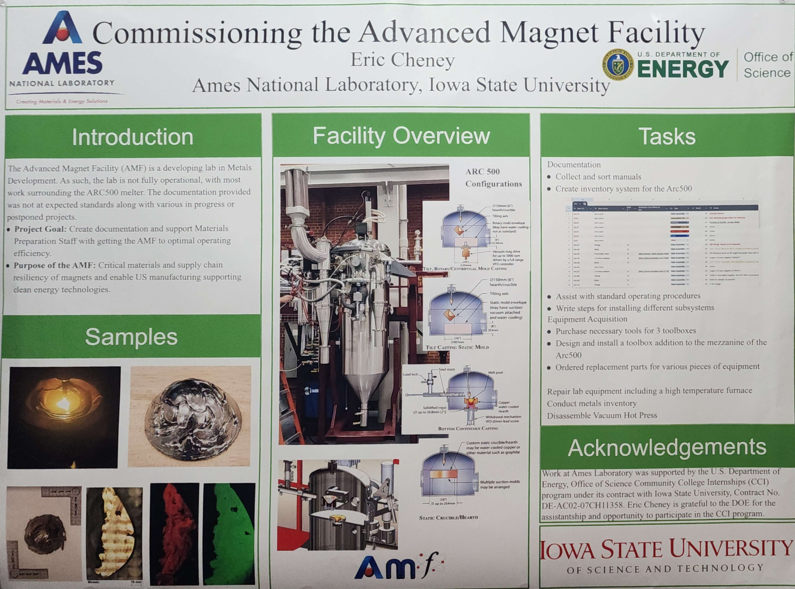
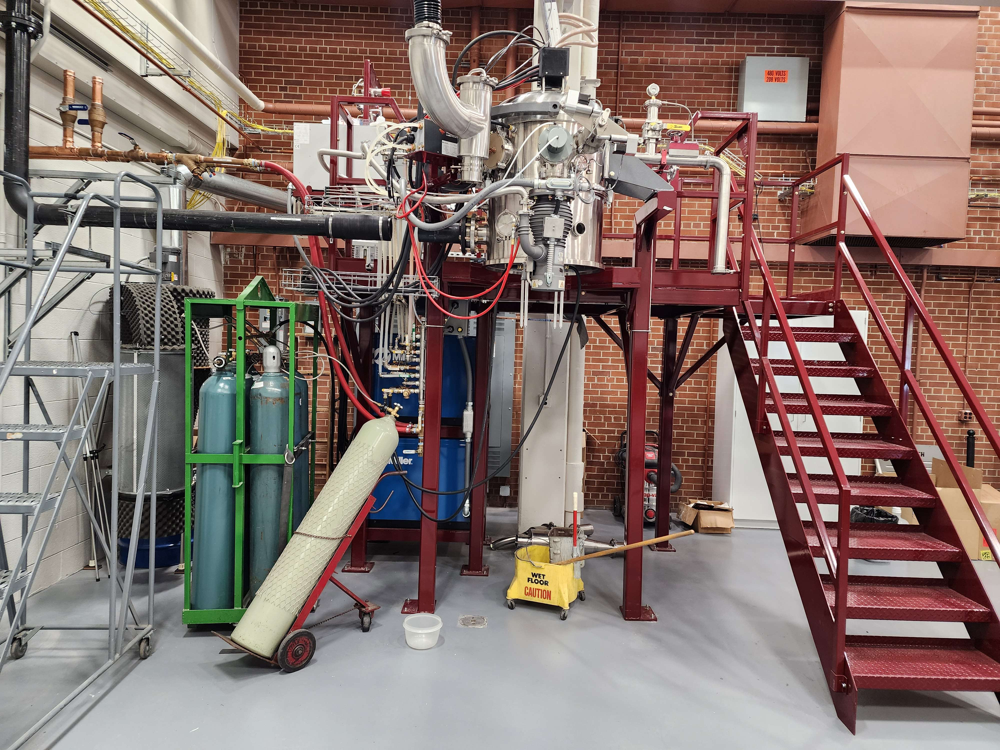
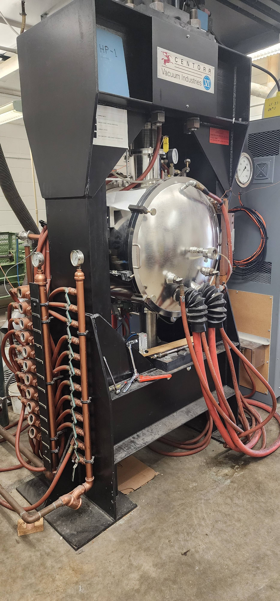
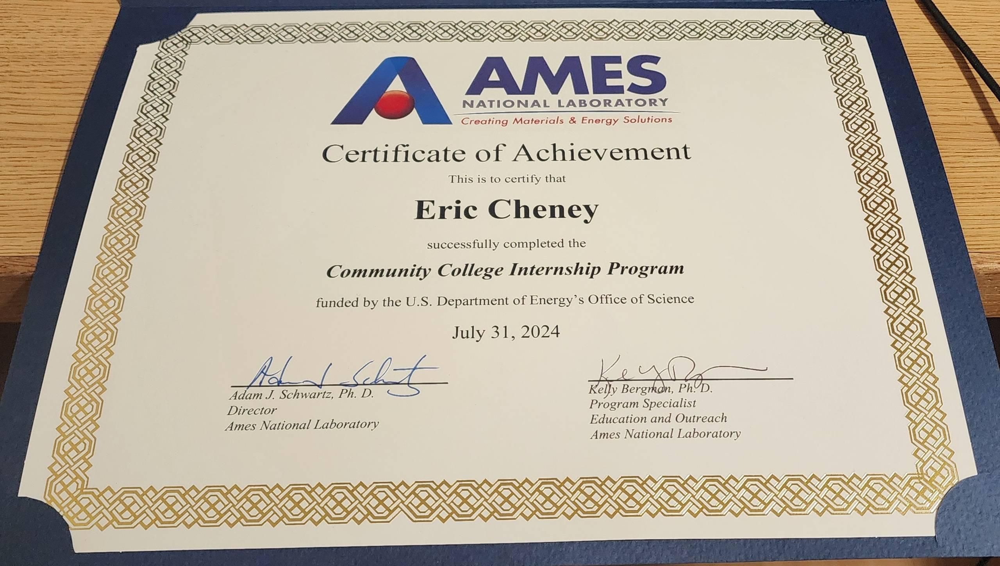

# Ames National Laboratory Internship

> Summer Internship 

During this internship, I mentored under the Lab Director of the Metals Division at Ames Lab. I was assigned to getting the new state of the art lab setup and documented. Much of this was documentation, detailing various parts of the Arc500, an advanced arc melter. As well as this, I gathered lab manuals, and wrote standard operating procedures such as how to install different configurations and safety measures. Along with this, I performed general lab activities such as XRF scanning, metals inventory, and equipment repair, maintenance, and daily checks. This was mainly a hands-on internship, working physically with the equipment and even taking apart and documenting a large vacuum hot press. However, I did design and test an addition to the mezzanine of the Arc500.

---
